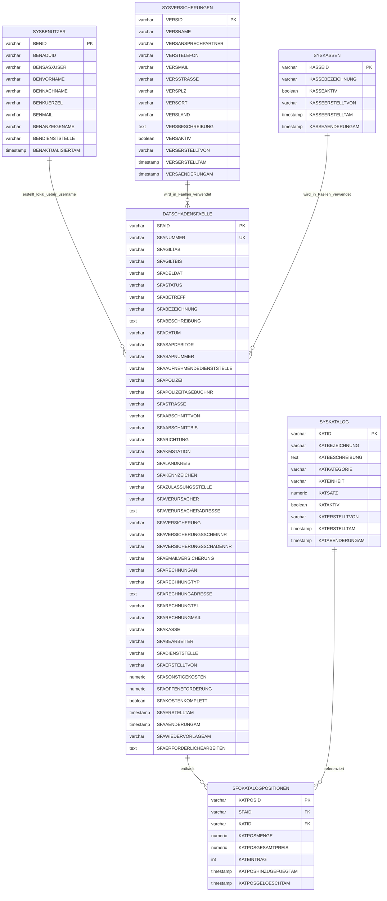

# ER-Modell

```mermaid
erDiagram
  SYSBENUTZER {
    varchar BENID PK
    varchar BENADUID
    varchar BENSASXUSER
    varchar BENVORNAME
    varchar BENNACHNAME
    varchar BENKUERZEL
    varchar BENMAIL
    varchar BENANZEIGENAME
    varchar BENDIENSTSTELLE
    timestamp BENAKTUALISIERTAM
  }

  DATSCHADENSFAELLE {
    varchar SFAID PK
    varchar SFANUMMER UK
    varchar SFAGILTAB
    varchar SFAGILTBIS
    varchar SFADELDAT
    varchar SFASTATUS
    varchar SFABETREFF
    varchar SFABEZEICHNUNG
    text SFABESCHREIBUNG
    varchar SFADATUM
    varchar SFASAPDEBITOR
    varchar SFASAPNUMMER
    varchar SFAAUFNEHMENDEDIENSTSTELLE
    varchar SFAPOLIZEI
    varchar SFAPOLIZEITAGEBUCHNR
    varchar SFASTRASSE
    varchar SFAABSCHNITTVON
    varchar SFAABSCHNITTBIS
    varchar SFARICHTUNG
    varchar SFAKMSTATION
    varchar SFALANDKREIS
    varchar SFAKENNZEICHEN
    varchar SFAZULASSUNGSSTELLE
    varchar SFAVERURSACHER
    text SFAVERURSACHERADRESSE
    varchar SFAVERSICHERUNG
    varchar SFAVERSICHERUNGSSCHEINNR
    varchar SFAVERSICHERUNGSSCHADENNR
    varchar SFAEMAILVERSICHERUNG
    varchar SFARECHNUNGAN
    varchar SFARECHNUNGTYP
    text SFARECHNUNGADRESSE
    varchar SFARECHNUNGTEL
    varchar SFARECHNUNGMAIL
    varchar SFAKASSE
    varchar SFABEARBEITER
    varchar SFADIENSTSTELLE
    varchar SFAERSTELLTVON
    numeric SFASONSTIGEKOSTEN
    numeric SFAOFFENEFORDERUNG
    boolean SFAKOSTENKOMPLETT
    timestamp SFAERSTELLTAM
    timestamp SFAAENDERUNGAM
    varchar SFAWIEDERVORLAGEAM
    text SFAERFORDERLICHEARBEITEN
  }

  SYSKATALOG {
    varchar KATID PK
    varchar KATBEZEICHNUNG
    text KATBESCHREIBUNG
    varchar KATKATEGORIE
    varchar KATEINHEIT
    numeric KATSATZ
    boolean KATAKTIV
    varchar KATERSTELLTVON
    timestamp KATERSTELLTAM
    timestamp KATAEENDERUNGAM
  }

  SYSVERSICHERUNGEN {
    varchar VERSID PK
    varchar VERSNAME
    varchar VERSANSPRECHPARTNER
    varchar VERSTELEFON
    varchar VERSMAIL
    varchar VERSSTRASSE
    varchar VERSPLZ
    varchar VERSORT
    varchar VERSLAND
    text VERSBESCHREIBUNG
    boolean VERSAKTIV
    varchar VERSERSTELLTVON
    timestamp VERSERSTELLTAM
    timestamp VERSAENDERUNGAM
  }

  SYSKASSEN {
    varchar KASSEID PK
    varchar KASSEBEZEICHNUNG
    boolean KASSEAKTIV
    varchar KASSEERSTELLTVON
    timestamp KASSEERSTELLTAM
    timestamp KASSEAENDERUNGAM
  }

  SFOKATALOGPOSITIONEN {
    varchar KATPOSID PK
    varchar SFAID FK
    varchar KATID FK
    numeric KATPOSMENGE
    numeric KATPOSGESAMTPREIS
    int KATEINTRAG
    timestamp KATPOSHINZUGEFUEGTAM
    timestamp KATPOSGELOESCHTAM
  }

  DATSCHADENSFAELLE ||--o{ SFOKATALOGPOSITIONEN : enthaelt
  SYSKATALOG ||--o{ SFOKATALOGPOSITIONEN : referenziert
  SYSBENUTZER ||--o{ DATSCHADENSFAELLE : erstellt_lokal_ueber_username
  SYSVERSICHERUNGEN ||--o{ DATSCHADENSFAELLE : wird_in_Faellen_verwendet
  SYSKASSEN ||--o{ DATSCHADENSFAELLE : wird_in_Faellen_verwendet
```