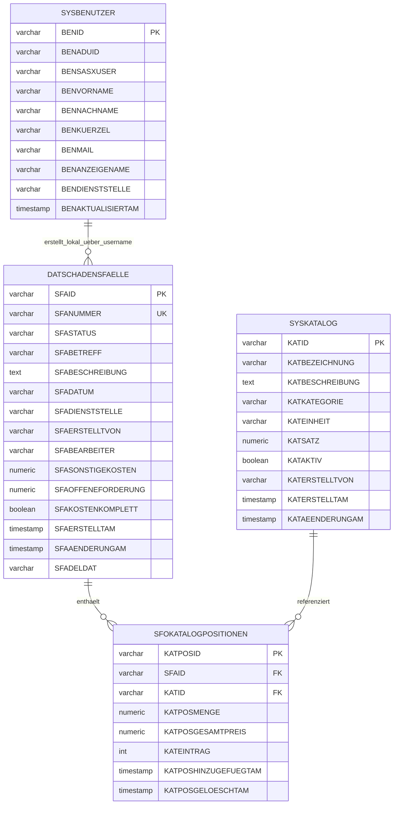

# ER-Modell

```mermaid
erDiagram
  SYSBENUTZER {
    varchar BENID PK
    varchar BENADUID
    varchar BENSASXUSER
    varchar BENVORNAME
    varchar BENNACHNAME
    varchar BENKUERZEL
    varchar BENMAIL
    varchar BENANZEIGENAME
    varchar BENDIENSTSTELLE
    timestamp BENAKTUALISIERTAM
  }

  DATSCHADENSFAELLE {
    varchar SFAID PK
    varchar SFANUMMER UK
    varchar SFASTATUS
    varchar SFABETREFF
    text SFABESCHREIBUNG
    varchar SFADATUM
    varchar SFADIENSTSTELLE
    varchar SFAERSTELLTVON
    varchar SFABEARBEITER
    numeric SFASONSTIGEKOSTEN
    numeric SFAOFFENEFORDERUNG
    boolean SFAKOSTENKOMPLETT
    timestamp SFAERSTELLTAM
    timestamp SFAAENDERUNGAM
    varchar SFADELDAT
  }

  SYSKATALOG {
    varchar KATID PK
    varchar KATBEZEICHNUNG
    text KATBESCHREIBUNG
    varchar KATKATEGORIE
    varchar KATEINHEIT
    numeric KATSATZ
    boolean KATAKTIV
    varchar KATERSTELLTVON
    timestamp KATERSTELLTAM
    timestamp KATAEENDERUNGAM
  }

  SFOKATALOGPOSITIONEN {
    varchar KATPOSID PK
    varchar SFAID FK
    varchar KATID FK
    numeric KATPOSMENGE
    numeric KATPOSGESAMTPREIS
    int KATEINTRAG
    timestamp KATPOSHINZUGEFUEGTAM
    timestamp KATPOSGELOESCHTAM
  }

  DATSCHADENSFAELLE ||--o{ SFOKATALOGPOSITIONEN : enthaelt
  SYSKATALOG ||--o{ SFOKATALOGPOSITIONEN : referenziert
  SYSBENUTZER ||--o{ DATSCHADENSFAELLE : erstellt_lokal_ueber_username
```