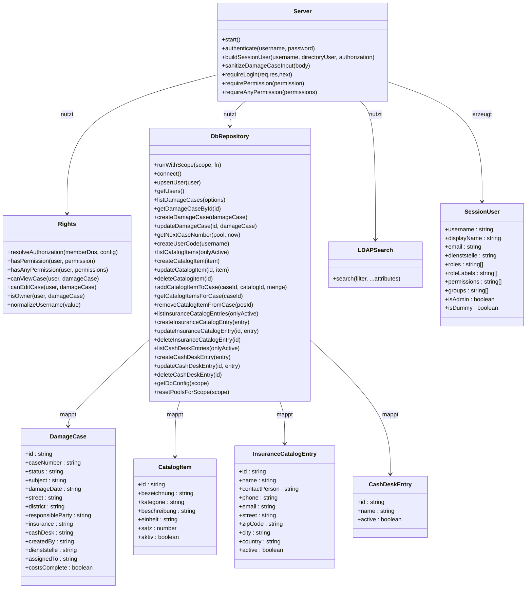

# UML-Klassendiagramm

```mermaid
classDiagram
  class Server {
    +start()
    +authenticate(username, password)
    +buildSessionUser(username, directoryUser, authorization)
    +sanitizeDamageCaseInput(body)
    +requireLogin(req,res,next)
    +requirePermission(permission)
    +requireAnyPermission(permissions)
  }

  class Rights {
    +resolveAuthorization(memberDns, config)
    +hasPermission(user, permission)
    +hasAnyPermission(user, permissions)
    +canViewCase(user, damageCase)
    +canEditCase(user, damageCase)
    +isOwner(user, damageCase)
    +normalizeUsername(value)
  }

  class DbRepository {
    +runWithScope(scope, fn)
    +connect()
    +upsertUser(user)
    +getUsers()
    +listDamageCases(options)
    +getDamageCaseById(id)
    +createDamageCase(damageCase)
    +updateDamageCase(id, damageCase)
    +getNextCaseNumber(pool, now)
    +createUserCode(username)
    +listCatalogItems(onlyActive)
    +createCatalogItem(item)
    +updateCatalogItem(id, item)
    +deleteCatalogItem(id)
    +addCatalogItemToCase(caseId, catalogId, menge)
    +getCatalogItemsForCase(caseId)
    +removeCatalogItemFromCase(posId)
    +listInsuranceCatalogEntries(onlyActive)
    +createInsuranceCatalogEntry(entry)
    +updateInsuranceCatalogEntry(id, entry)
    +deleteInsuranceCatalogEntry(id)
    +listCashDeskEntries(onlyActive)
    +createCashDeskEntry(entry)
    +updateCashDeskEntry(id, entry)
    +deleteCashDeskEntry(id)
    +getDbConfig(scope)
    +resetPoolsForScope(scope)
  }

  class LDAPSearch {
    +search(filter, ...attributes)
  }

  class SessionUser {
    +username : string
    +displayName : string
    +email : string
    +dienststelle : string
    +roles : string[]
    +roleLabels : string[]
    +permissions : string[]
    +groups : string[]
    +isAdmin : boolean
    +isDummy : boolean
  }

  class DamageCase {
    +id : string
    +caseNumber : string
    +status : string
    +subject : string
    +damageDate : string
    +street : string
    +district : string
    +responsibleParty : string
    +insurance : string
    +cashDesk : string
    +createdBy : string
    +dienststelle : string
    +assignedTo : string
    +costsComplete : boolean
  }

  class CatalogItem {
    +id : string
    +bezeichnung : string
    +kategorie : string
    +beschreibung : string
    +einheit : string
    +satz : number
    +aktiv : boolean
  }

  class InsuranceCatalogEntry {
    +id : string
    +name : string
    +contactPerson : string
    +phone : string
    +email : string
    +street : string
    +zipCode : string
    +city : string
    +country : string
    +active : boolean
  }

  class CashDeskEntry {
    +id : string
    +name : string
    +active : boolean
  }

  Server --> Rights : nutzt
  Server --> DbRepository : nutzt
  Server --> LDAPSearch : nutzt
  Server --> SessionUser : erzeugt
  DbRepository --> DamageCase : mappt
  DbRepository --> CatalogItem : mappt
  DbRepository --> InsuranceCatalogEntry : mappt
  DbRepository --> CashDeskEntry : mappt
```