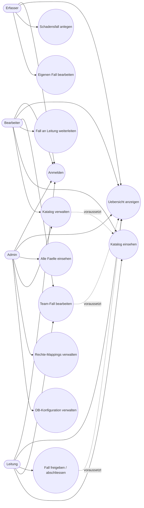

# Use-Case-Diagramm

```mermaid
flowchart LR
  actor_erfasser([Erfasser])
  actor_bearbeiter([Bearbeiter])
  actor_leitung([Leitung])
  actor_admin([Admin])

  uc_login((Anmelden))
  uc_overview((Uebersicht anzeigen))
  uc_create((Schadensfall anlegen))
  uc_edit_own((Eigenen Fall bearbeiten))
  uc_edit_team((Team-Fall bearbeiten))
  uc_forward((Fall an Leitung weiterleiten))
  uc_approve((Fall freigeben / abschliessen))
  uc_view_all((Alle Faelle einsehen))
  uc_catalog_view((Katalog einsehen))
  uc_catalog_manage((Katalog verwalten))
  uc_rights_manage((Rechte-Mappings verwalten))
  uc_db_manage((DB-Konfiguration verwalten))

  actor_erfasser --> uc_login
  actor_bearbeiter --> uc_login
  actor_leitung --> uc_login
  actor_admin --> uc_login

  actor_erfasser --> uc_overview
  actor_bearbeiter --> uc_overview
  actor_leitung --> uc_overview
  actor_admin --> uc_overview

  actor_erfasser --> uc_create
  actor_erfasser --> uc_edit_own

  actor_bearbeiter --> uc_edit_team
  actor_bearbeiter --> uc_forward
  actor_bearbeiter --> uc_catalog_view
  actor_bearbeiter --> uc_catalog_manage

  actor_leitung --> uc_approve
  actor_leitung --> uc_edit_team
  actor_leitung --> uc_catalog_view

  actor_admin --> uc_view_all
  actor_admin --> uc_catalog_manage
  actor_admin --> uc_rights_manage
  actor_admin --> uc_db_manage

  uc_edit_team -. voraussetzt .-> uc_overview
  uc_approve -. voraussetzt .-> uc_overview
  uc_catalog_manage -. voraussetzt .-> uc_catalog_view
```